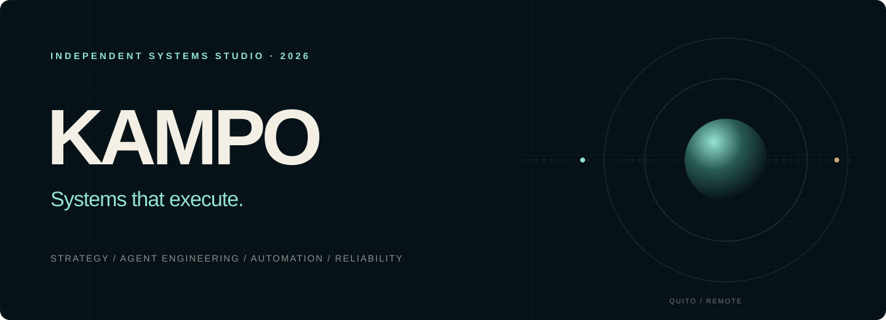

  

  <a href="https://velizmurillofrabrizzio-lab.github.io/daruma.github.io/"><strong>Website</strong></a>
  &nbsp;·&nbsp;
  <a href="https://velizmurillofrabrizzio-lab.github.io/daruma.github.io/presentation.html"><strong>Company portfolio</strong></a>
  &nbsp;·&nbsp;
  <a href="https://www.canva.com/d/0xo0ov3JvkWvNuM"><strong>Presentation</strong></a>

## Systems that execute.

KAMPO es un estudio independiente de sistemas. Diseñamos agentes programados, automatizaciones, integraciones y herramientas internas que convierten operaciones fragmentadas en flujos claros, verificables y preparados para evolucionar.

Nuestro trabajo reúne estrategia, producto, ingeniería, automatización y confiabilidad dentro de una sola dirección.

## Selected system

### KAMPO AI Dispatcher

**Prototipo funcional en desarrollo.** Una capa de decisión que recibe solicitudes, interpreta contexto, aplica reglas, selecciona una ruta de ejecución y conserva trazabilidad.

El Dispatcher está diseñado alrededor de cuatro principios:

- automatizar únicamente lo repetible;
- solicitar aprobación ante acciones sensibles;
- hacer visibles los estados y errores;
- permitir recuperación y transferencia humana.

[Explorar la arquitectura completa →](https://velizmurillofrabrizzio-lab.github.io/daruma.github.io/presentation.html)

## Practice areas

| Strategy & Product | Agent Engineering | Automation & APIs | Reliability & Delivery |
|:--|:--|:--|:--|
| Problema, alcance y primera versión útil. | Memoria, herramientas, permisos y acciones controladas. | Datos, eventos, servicios e integraciones. | Pruebas, límites, documentación y recuperación. |

## Public systems lab

| System | Focus |
|:--|:--|
| [DARUMA Methodology](https://github.com/velizmurillofrabrizzio-lab/daruma-methodology) | Estándares, criterios y documentación de entrega. |
| [Automation Toolkit](https://github.com/velizmurillofrabrizzio-lab/n8n-automation-toolkit) | Patrones de orquestación y automatización. |
| [Scraper API Engine](https://github.com/velizmurillofrabrizzio-lab/scraper-api-engine) | Extracción estructurada y servicios API. |
| [Messaging Systems](https://github.com/velizmurillofrabrizzio-lab/whatsapp-telegram-bot-factory) | Mensajería, estados y transferencia humana. |

## Company model

KAMPO es liderada por **Yosimar** y opera como una estructura funcional integrada. No usamos cargos para inflar tamaño: cada práctica existe para proteger una parte concreta del resultado.

`Executive Direction & Product` · `Strategy & Solutions` · `Sales Intelligence & Partnerships` · `Marketing & Brand` · `Software Engineering & IT` · `Automation & Integrations` · `Quality, Security & Reliability` · `Operations, Delivery & Client Success`

---

### Start with one process.

Construyamos una primera versión que pueda verse, probarse y mejorar.

[Abrir el portafolio corporativo →](https://velizmurillofrabrizzio-lab.github.io/daruma.github.io/)
